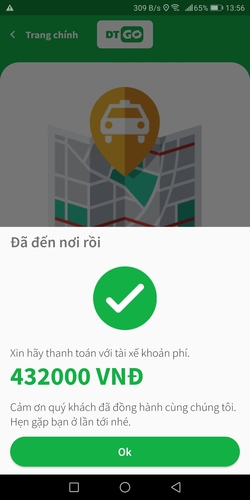

 

 
 

Real-time booking vehicle service, includes server, passenger and driver mobile app.

  

## Google Play Store Release

- [DTGO](https://play.google.com/store/apps/details?id=com.ducthu.datn.client_dt_go) application for passengers.

- [DTGO Driver](https://play.google.com/store/apps/details?id=com.ducthu.datn.driver_dt_go) application for drivers.

## About The Project

This project is inspired and cloned base on some other modern booking car/bike with real-time tracking driver position like Grab, Gojek, Uber,...

### Key features:

- Server is available to receive request from both passenger and driver and create an environment for them to communicate with each other.

- Driver register to receive trip with server, so when there are a new trip nearby available, he should accept and pick up passenger to the desire destination.

- Passenger book a vehicle to move to a destination, with current positon and destination data.

### Built With

This project use these framework and runtime environment:

- [Nodejs](https://nodejs.org/en/) for server side.

- [Flutter](https://flutter.dev/) for mobile app side.

The most important package of this project so that devices can communicate with each other almost real-time is [Socket.io](https://socket.io/) for Server - Nodejs and [Socket.io Client](https://pub.dev/packages/socket_io_client) for Mobile - Dart/Flutter.

## DEMO

### Regular trip

   

### Register User

  

### No Driver available

### Driver accepts trip but passenger canceled trip just before.

 

### Passenger cancel in trip

 

### 1 Passenger register trip, 2 Driver waiting for trip

  

### 1 Driver waiting for trip, 2 Passenger register trip

  

## Screenshots

### DTGO

### DTGO Driver

        

## Author

👤 **DucThu-Dev**

- Website: https://github.com/DucThu-Dev

- Github: [@DucThu-Dev](https://github.com/DucThu-Dev)

- LinkedIn: [@Trần Đức Thư](https://linkedin.com/in/Trần Đức Thư)
